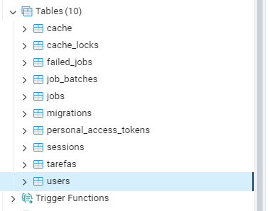
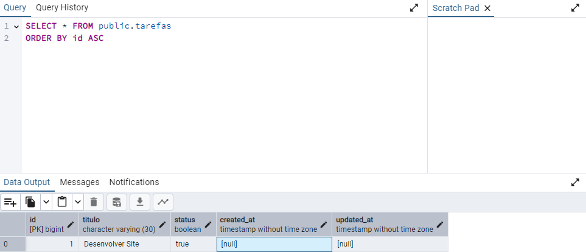
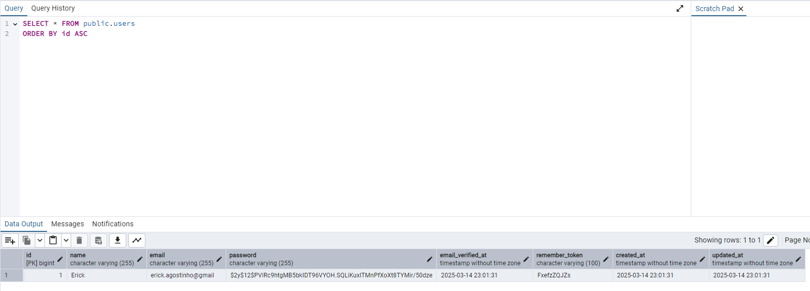
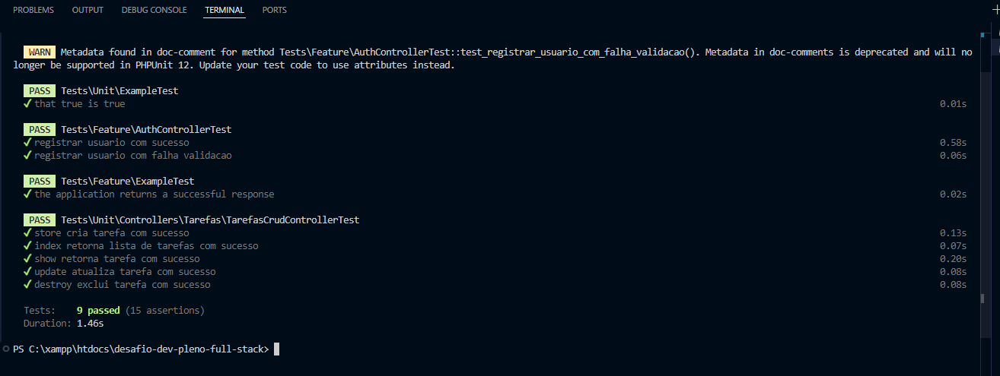

# **Desafio Desenvolvedor Pleno Full Stack - Gerenciamento de Tarefas**

## **📌 Sobre o Projeto**

Este projeto foi desenvolvido como parte de um desafio técnico para avaliar as habilidades de um desenvolvedor pleno. O sistema consiste em uma aplicação de  **gerenciamento de tarefas** , onde usuários podem criar, atualizar, visualizar e excluir tarefas.

O desenvolvimento seguiu boas práticas de arquitetura, utilizando o  **SOLID** , autenticação segura com  **JWT** , e documentação automatizada com **Postman** e  **Swagger** . O projeto foi concluído dentro do prazo estipulado de uma semana.

## **📌 Tecnologias Utilizadas**

### **🔹 Backend:**

* PHP 7.4.33
* Laravel 8.83.29
* PostgreSQL
* JWT para autenticação
* Arquitetura SOLID
* Testes automatizados com PHPUnit

### **🔹 Frontend:**

* Vue.js
* HTML5, CSS3, JavaScript
* Bootstrap
* DataTable

### **🔹 Documentação:**

* Postman
* Swagger

### **🔹 Integração com API Externa:**

* ViaCEP (consulta de endereços pelo CEP)

## **📌 Banco de Dados**

O projeto utiliza **PostgreSQL** e toda a estrutura do banco é gerenciada por meio de  **migrations nativas do Laravel** . Isso garante consistência entre as tabelas e os modelos da aplicação.

### 🛢️ **Criação do Banco de Dados**


### 📊 **Migração de Tabelas**



### 📋 **Estrutura das Tabelas**

#### **Tarefas**



#### **Usuários**



## **📌 Back-End/API**

O backend da aplicação segue os princípios  **SOLID** , garantindo um código limpo, modular e de fácil manutenção. As rotas são protegidas por autenticação JWT e documentadas com **Postman** e  **Swagger** . O padrão RESTful foi seguido para garantir uma API organizada e previsível.

### 🔹 **Rotas Disponíveis**

#### **Autenticação (AuthController)**

```php
Route::controller(AuthController::class)->prefix('usuario')->group(function () {
    Route::post('login', 'login');
    Route::post('registrar', 'registrar');
    Route::get('detalhar', 'detalhar')->middleware('token');
    Route::get('logout', 'logout')->middleware('token');
});
```

* `POST /api/usuario/login` → Realiza login e retorna um token JWT
* `POST /api/usuario/registrar` → Registra um novo usuário
* `GET /api/usuario/detalhar` → Retorna os dados do usuário autenticado
* `GET /api/usuario/logout` → Invalida o token JWT do usuário

#### **Gerenciamento de Tarefas (TarefasCrudController)**

```php
Route::resource('tarefas', TarefasCrudController::class);
```

* `GET /api/tarefas` → Lista todas as tarefas
* `POST /api/tarefas` → Cria uma nova tarefa
* `GET /api/tarefas/{id}` → Exibe uma tarefa específica
* `PUT /api/tarefas/{id}` → Atualiza uma tarefa
* `DELETE /api/tarefas/{id}` → Exclui uma tarefa

### 🔹 **Documentação da API**

Todas as rotas foram documentadas com **Postman** e  **Swagger** . A documentação está acessível via:

* **Swagger UI:** `GET /api/documentation`
* **Coleção Postman:** [Link para a coleção](http://localhost:8000/api/documentation) *(após instalação de projeto, conferir em ambiente local)*

### 🔹 **Princípios SOLID e Estrutura do Código**

Este projeto segue os princípios SOLID descritos na base de projeto Laravel  **[Perfect Laravel Base](https://github.com/r4mpo/perfect-laravel-base)** .

**Algumas boas práticas adotadas:**

* **Repositórios e Services** para separar a lógica de negócio dos controllers
* **Injeção de Dependência** para reduzir acoplamento
* **DTOs (Data Transfer Objects)** para padronizar os dados trafegados
* **Middlewares** para segurança e controle de acesso

## **📌 Testes Automatizados**

Os testes foram implementados usando PHPUnit para garantir o funcionamento adequado do backend. Eles incluem:

* Testes de autenticação
* Testes de criação, edição e remoção de tarefas

Para executar os testes:

```sh
php artisan test
```



---

## **📌 Conclusão**

Este projeto foi desenvolvido visando qualidade de código, organização e boas práticas. Ele serve como um modelo para aplicações Laravel bem estruturadas. Caso tenha alguma dúvida ou sugestão, fique à vontade para contribuir ou abrir uma issue! 🚀
