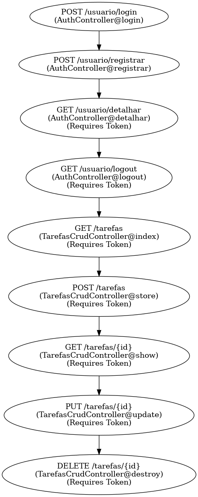
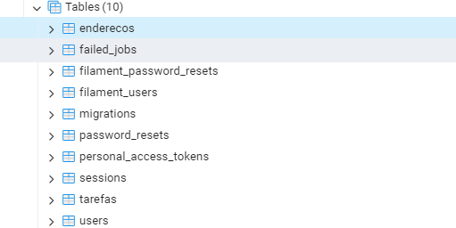
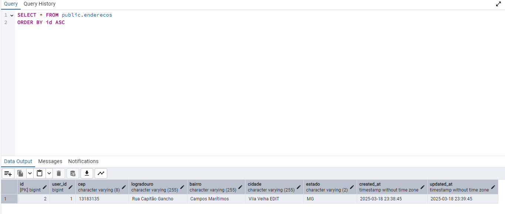
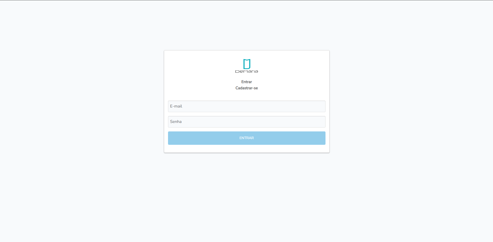
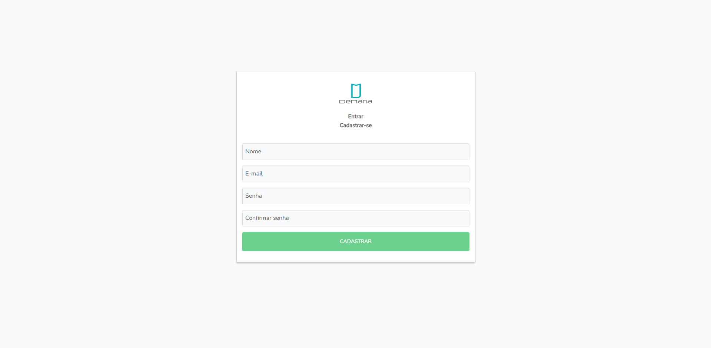
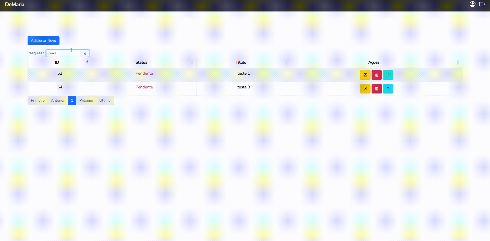
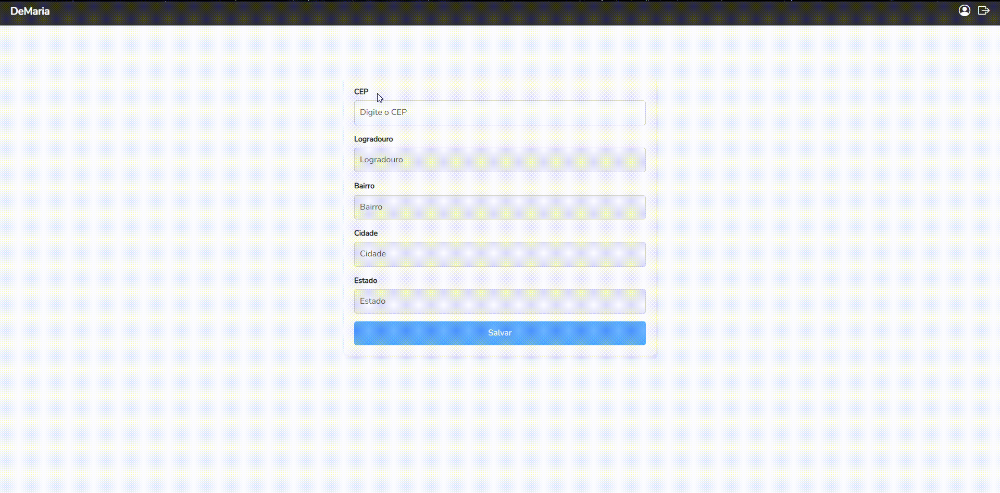

# **Desafio Desenvolvedor Pleno Full Stack - Gerenciamento de Tarefas**

## **📌 Sobre o Projeto**

Este projeto foi desenvolvido como parte de um desafio técnico para avaliar as habilidades de um desenvolvedor pleno. O sistema consiste em uma aplicação de  **gerenciamento de tarefas** , onde usuários podem criar, atualizar, visualizar e excluir tarefas.

O desenvolvimento seguiu boas práticas de arquitetura, utilizando o  **SOLID** , autenticação segura com  **JWT** , e documentação automatizada com **Postman** e  **Swagger** . O projeto foi concluído dentro do prazo estipulado de uma semana.

## **📌 Tecnologias Utilizadas**

### **🔹 Backend:**

* PHP 7.4.33
* Laravel 8.83.29
* PostgreSQL
* JWT para autenticação
* Arquitetura SOLID
* Testes automatizados com PHPUnit

### **🔹 Frontend:**

* Vue.js
* HTML5, CSS3, JavaScript
* Bootstrap
* DataTable
* Vue-Router
* JQuery
* Axios

### **🔹 Documentação:**

* Postman
* Swagger

### **🔹 Integração com API Externa:**

* ViaCEP (consulta de endereços pelo CEP)

## **📌 Fluxograma de Rotas Principais**



## **📌 Banco de Dados**

O projeto utiliza **PostgreSQL** e toda a estrutura do banco é gerenciada por meio de  **migrations nativas do Laravel** . Isso garante consistência entre as tabelas e os modelos da aplicação.

### 🛢️ **Criação do Banco de Dados**


### 📊 **Migração de Tabelas**



### 📋 **Estrutura das Tabelas**

#### **Tarefas**


#### **Usuários**


#### **Endereços**



## **📌 Back-End**

O backend da aplicação segue os princípios  **SOLID** , garantindo um código limpo, modular e de fácil manutenção. As rotas são protegidas por autenticação JWT e documentadas com **Postman** e  **Swagger** . O padrão RESTful foi seguido para garantir uma API organizada e previsível.

### 🔹 **Rotas Disponíveis**

#### **Autenticação (AuthController)**

```php
Route::controller(AuthController::class)->prefix('usuario')->group(function () {
    Route::post('login', 'login');
    Route::post('registrar', 'registrar');
    Route::get('detalhar', 'detalhar')->middleware('token');
    Route::get('logout', 'logout')->middleware('token');
});
```

* `POST /api/usuario/login` → Realiza login e retorna um token JWT
* `POST /api/usuario/registrar` → Registra um novo usuário
* `GET /api/usuario/detalhar` → Retorna os dados do usuário autenticado
* `GET /api/usuario/logout` → Invalida o token JWT do usuário

#### **Gerenciamento de Tarefas (TarefasCrudController)**

```php
Route::resource('tarefas', TarefasCrudController::class);
```

* `GET /api/tarefas` → Lista todas as tarefas
* `POST /api/tarefas` → Cria uma nova tarefa
* `GET /api/tarefas/{id}` → Exibe uma tarefa específica
* `PUT /api/tarefas/{id}` → Atualiza uma tarefa
* `DELETE /api/tarefas/{id}` → Exclui uma tarefa

### 🔹 **Documentação da API**

Todas as rotas foram documentadas com **Postman** e  **Swagger** . A documentação está acessível via:

* **Swagger UI:** `GET /api/documentation`
* **Coleção Postman:** collection\API Laravel - Gerenciamento Tarefas.postman_collection.json

### 🔹 **Princípios SOLID e Estrutura do Código**

Este projeto segue os princípios SOLID descritos na base de projeto Laravel  **[Perfect Laravel Base](https://github.com/r4mpo/perfect-laravel-base)** .

**Algumas boas práticas adotadas:**

* **Repositórios e Services** para separar a lógica de negócio dos controllers
* **Injeção de Dependência** para reduzir acoplamento
* **DTOs (Data Transfer Objects)** para padronizar os dados trafegados
* **Middlewares** para segurança e controle de acesso

## **📌 Testes Automatizados**

Os testes foram implementados usando PHPUnit para garantir o funcionamento adequado do backend. Eles incluem:

* Testes de autenticação
* Testes de criação, edição e remoção de tarefas

Para executar os testes:

```sh
php artisan test
```


## **📌 Front-End**

### 📱 Documentação API - Swagger

Documentação completa da API pelo Swagger, com informações sobre cada uma das rotas e proteção por autenticação:


### 📱 Login e Registro

Interface de registro e autenticação de usuários:





### 📱 Tarefas

Interações demonstradas na interface de gestão das tarefas, onde pode-se visualizar dados, cadastrar novas informações, atualizar, excluir e alterar o status de uma atividade. Confira a seguir:




### 📱 Endereços

Interface responsável por integrar a API Pública do ViaCep, sendo um serviço web externo, com a API interna deste projeto, salvando as informações em nossa base de dados local. (Bônus: Neste momento, aproveito e mostro o logout, hahaha):



---

## **🖥️ Instalação do Projeto em Ambiente Linux ou Windows**

```md
# 📌 Manual de Instalação - Projeto Laravel

Este guia fornece as etapas para instalar e configurar o projeto Laravel corretamente.

## 🚀 Requisitos

Antes de começar, certifique-se de ter os seguintes requisitos instalados:

- PHP 7.4+
- Composer
- PostgreSQL ou outro banco de dados compatível
- Node.js e npm

## 📥 Passo a Passo da Instalação

### 1️⃣ Clonar o Projeto
Clone o repositório do GitHub para sua máquina local:

```sh
git clone https://github.com/r4mpo/desafio-dev-pleno-full-stack.git
cd desafio-dev-pleno-full-stack
```

### 2️⃣ Criar o Arquivo `.env`

Copie o arquivo `.env.example` e renomeie para `.env`:

```sh
cp .env.example .env
```

### 3️⃣ Configurar o `.env`

Edite o arquivo `.env` e configure as credenciais do banco de dados:

```env
DB_CONNECTION=pgsql
DB_HOST=127.0.0.1
DB_PORT=5432
DB_DATABASE=seu_banco
DB_USERNAME=seu_usuario
DB_PASSWORD=sua_senha
```

### 4️⃣ Instalar Dependências

Execute os comandos abaixo para instalar as dependências do projeto:

```sh
composer install
composer update
```

### 5️⃣ Rodar as Migrações

Crie as tabelas no banco de dados executando as migrations:

```sh
php artisan migrate
```

### 6️⃣ Gerar Chave do JWT

Gere a chave necessária para autenticação com JWT:

```sh
php artisan jwt:secret
```

### 7️⃣ Iniciar o Servidor Laravel

Inicie o servidor de desenvolvimento do Laravel:

```sh
php artisan serve
```

O backend estará disponível em `http://127.0.0.1:8000`.

### 8️⃣ Instalar e Configurar o Frontend

Se o projeto possuir frontend com Vue.js ou outra tecnologia, execute:

```sh
npm install
npm run dev
```

---

### **📌 Conclusão**

Este projeto demonstrou a capacidade de estruturar e desenvolver uma aplicação robusta, segura e escalável, seguindo os princípios do **SOLID** e adotando boas práticas do desenvolvimento  **Full Stack** . A solução proposta abrange tanto o backend, construído em  **Laravel** , quanto o frontend, desenvolvido com  **Vue.js** , garantindo uma experiência eficiente para os usuários no gerenciamento de tarefas.

A utilização de  **autenticação JWT** , integração com **API externa (ViaCEP)** e documentação com **Swagger e Postman** reforça o compromisso com a segurança e organização do código. Além disso, o projeto conta com  **testes automatizados com PHPUnit** , assegurando a confiabilidade das funcionalidades implementadas.

Com uma arquitetura bem definida e modular, o código se mantém limpo, reutilizável e de fácil manutenção. Este desafio proporcionou uma excelente oportunidade para demonstrar habilidades técnicas e reafirmar a importância de seguir padrões no desenvolvimento de software.

🚀 **Pronto para expandir!** Este projeto pode ser facilmente escalado e aprimorado com novas funcionalidades, garantindo sua evolução conforme as necessidades do usuário.

Caso tenha dúvidas ou sugestões, fique à vontade para contribuir! 🤝
